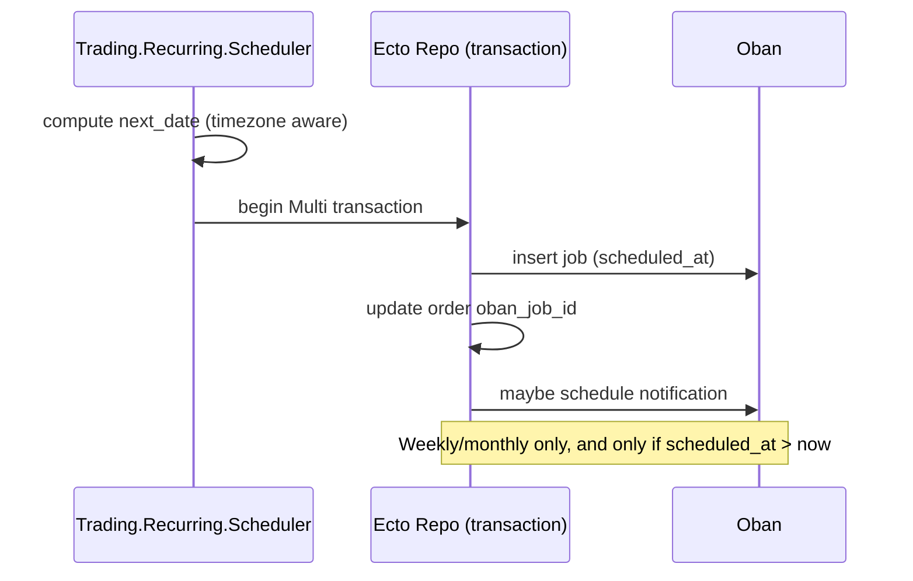

# GoldFish Design Document

## Purpose and scope
GoldFish is an Elixir/Phoenix application that implements:

- External (public) APIs (customer and mobile-facing JSON APIs)
- Internal/admin APIs (service-to-service and operational endpoints)
- Storm admin web interface (Phoenix LiveView + HTML) and related admin APIs
- Vendor callback/webhook endpoints (e.g., BitGo, Plaid, Modern Treasury, DocuSign, TaxBit, Cognito)
- Operational telemetry endpoints (metrics) and OpenAPI/Swagger UI (non-prod)

This document describes the architecture as implemented in the repo (OTP supervision tree, endpoints/routers, background processing, and key integrations), and provides diagrams for the major runtime flows.

## High-level architecture

### System context diagram
GoldFish is a multi-surface application: end users and internal systems call APIs; vendors call webhook endpoints; and the app talks to a Postgres database and multiple external/internal services.

```mermaid
flowchart LR
  Clients[Clients\n(Web/Mobile/3rd parties)]
  StormUsers[Ops/CSRs\n(Storm UI)]
  Vendors[Vendors\n(Webhooks/APIs)]
  InternalSvcs[Internal services\n(e.g., Cerebro, Magneto, Thor, Groot)]
  DB[(Postgres\nEcto Repo)]
  Jobs[Oban Queues\n+ Cron]
  Metrics[Metrics / Tracing]

  GoldFish[GoldFish\n(Phoenix + Ecto + Oban)]

  Clients -->|JSON APIs| GoldFish
  StormUsers -->|HTML/LiveView| GoldFish
  Vendors -->|Webhooks| GoldFish
  GoldFish -->|API calls| Vendors
  GoldFish -->|S2S calls| InternalSvcs
  GoldFish --> DB
  GoldFish --> Jobs
  GoldFish --> Metrics
```

### Core technology stack
- Elixir/OTP: fault-tolerant concurrency and supervision
- Phoenix: HTTP endpoints, routing, controllers, LiveView (Storm)
- Ecto + Postgres: persistence via `GoldFish.Repo`
- Oban: background jobs, queues, and cron scheduling (`config/config.exs`)
- Quantum: additional scheduler (`GoldFish.QuantumScheduler`)
- Tesla: HTTP client (Hackney adapter) with OpenCensus instrumentation
- Tracing/Metrics: OpenCensus + custom instrumentation + Prometheus endpoint

## Runtime and supervision

### OTP supervision tree (top-level)
At application boot, `GoldFish.Application` starts a single top-level supervisor with children including:

- Persistence: `GoldFish.Repo`
- PubSub: `Phoenix.PubSub` (Storm PubSub)
- HTTP endpoints: customer/public API, internal API, metrics, Storm UI, and vendor callback endpoints
- Domain supervisors: Interest Accounts, Loans, Trading limits/config caches, etc.
- Background systems: Oban, Quantum scheduler, watcher supervisors, task supervisors
- Auth infrastructure: Cerebro pool, JWKS strategy supervisor
- Feature flags: LaunchDarkly initialization at boot

```mermaid
flowchart TB
  Sup[GoldFish.Supervisor\n(one_for_one)]

  Repo[GoldFish.Repo\nEcto Repo]
  Endpoints[Phoenix Endpoints\nPublic API / Internal API / Metrics\nStorm UI / Vendor webhooks / OpenAPI]
  Oban[Oban\nQueues + Plugins + Cron]

  Auth[Auth\nCerebro Pool\nJWKS Strategy]
  Domains[Domain Supervisors\nInterest Accounts / Loans\nTrading Limit + Caches\nTaxCenter Cache]
  Sched[Schedulers/Watchers\nQuantum / Ticker Watchers\nTask.Supervisor]

  Sup --> Repo
  Sup --> Endpoints
  Sup --> Oban
  Repo --> Auth
  Endpoints --> Domains
  Oban --> Sched
```

## HTTP surfaces

### Endpoint inventory (dev defaults)
In development, GoldFish runs multiple ports for distinct endpoints (`config/dev.exs`):

- Public API: `GoldFishWeb.Endpoint` (4000)
- Metrics: `GoldFishWeb.Metrics.Endpoint` (4001)
- Storm (admin UI): `GoldFish.StormWeb.Endpoint` (4002)
- Internal API: `GoldFishWeb.InternalApi.Endpoint` (4004)
- DocuSign callbacks: `GoldFishWeb.DocuSign.Endpoint` (4101)
- BitGo callbacks: `GoldFishWeb.BitGo.Endpoint` (4102)
- Cognito callbacks: `GoldFishWeb.Cognito.Endpoint` (4104)
- Plaid callbacks: `GoldFishWeb.Plaid.Endpoint` (4105)
- Modern Treasury callbacks: `GoldFishWeb.ModernTreasury.Endpoint` (4106)
- OpenAPI/Swagger UI: `GoldFishWeb.OpenApi.Endpoint` (4107)
- TaxBit callbacks: `GoldFishWeb.TaxBit.Endpoint` (4108)

### Routing overview
Public API Router (`lib/goldfish_web/router.ex`) exposes:

- Customer APIs under `/api/v1` and `/api/v2` (accounts, loans, trading, tax center, statements, etc.)
- Institutional routes under `/api/v1/institutional` and `/api/v2/institutional`
- Health endpoint `/api/v1/health`
- Webhooks scope `/api/v1/webhooks`

Storm Router (`lib/goldfish_storm_web/router.ex`) provides:

- JSON admin API: `/storm/api/v1` secured by API key auth
- Browser authentication routes under `/storm/auth`
- Storm UI routes under `/storm` (mostly LiveView + controllers), protected by auth and TOTP setup requirements
- Feature flags UI mounted under `/storm/feature-flags`

### OpenAPI/Swagger (non-prod)
The OpenAPI router (`lib/goldfish_web/open_api/router.ex`) is enabled in non-prod and serves:

- `/api/spec`: JSON OpenAPI spec (OpenApiSpex)
- `/swaggerui`: Swagger UI pointing at `/api/spec`

## Authentication and authorization

### Public API auth pipelines
The public router defines multiple pipelines, including:

- Customer API: JSON accepts, Cognito pool plug, ensure-not-frozen, and audit actor attribution
- Admin API: Cognito admin pool plug, ensure-not-frozen, and audit actor attribution
- JWT/Cerebro/Auth0: JWT validation + Cerebro token resolution and access plug gating

### Storm auth
Storm separates:

- Browser UI: session-based auth; protected routes enforce authentication and (in many cases) TOTP setup
- Storm API: API-key authentication via `GoldFish.StormWeb.APIKeyAuth`

## Background processing

### Oban queues and cron
Oban is configured with many queues (e.g., `thor`, `interest_calculations`, `trading_recurring_orders`) and a cron schedule (e.g., wallet generators, monitors, institutional sync workers) in `config/config.exs`.

```mermaid
flowchart TB
  API[Phoenix request\n(controller / liveview)]
  DB[DB transaction\n(Ecto + Repo)]
  Enq[Enqueue Oban job\n(Oban.insert)]
  Worker[Oban worker\n(per queue concurrency)]
  SideFX[Side effects\n(vendor/API calls)]

  API --> DB
  API --> Enq
  Enq --> Worker
  Worker --> DB
  Worker --> SideFX
```

### Recurring trading scheduling (example flow)
Recurring trading uses a scheduler module (`GoldFish.Trading.Recurring.Scheduler`) that:

- Computes the next execution time in a configured timezone
- Inserts an Oban job with `scheduled_at`
- Updates the order record to reference the scheduled job id
- Optionally schedules a reminder notification job ahead of execution



## Integration patterns

### HTTP clients (Tesla)
GoldFish uses Tesla (Hackney adapter) for service and vendor HTTP integrations. A representative pattern is:

- Base URL from application config
- JSON middleware (Jason) and standard headers
- Logging and OpenCensus middleware for traces

Example: `GoldFish.MagnetoClient` calls Magneto endpoints like `/api/v1/addresses/use` and `/api/v1/addresses/sync`.

### Feature flags
Feature flags are present via LaunchDarkly initialization at boot and FunWithFlags in-app toggles (e.g., Magneto address creation toggle).

## Operational concerns

### Observability
GoldFish includes:

- Request tracing via OpenCensus (Phoenix/Plug/Ecto/Tesla)
- Metrics endpoint (protected by basic auth in config)
- Instrumented background job execution (Oban measurement enabled)

### Failure handling strategy

- Supervision: OTP supervisors restart failed processes according to strategy
- Background work: Oban retries failed jobs; custom plugins handle stuck/orphaned jobs
- Idempotency: Many webhook and job workflows are designed to be retried safely (implementation-specific per worker)

## Appendix

### Primary source files
- `mix.exs` (deps, OTP app module)
- `lib/goldfish/application.ex` (supervision tree)
- `lib/goldfish_web/router.ex` (public API routes + auth pipelines)
- `lib/goldfish_storm_web/router.ex` (Storm UI + admin API)
- `config/config.exs` (Oban queues/cron, OpenAPI endpoint port, integrations)
- `config/dev.exs`, `config/prod.exs` (ports and deployment-time configuration)
- `lib/goldfish/trading/recurring/scheduler.ex` (recurring trading job scheduling)
- `lib/goldfish/magneto_client.ex` (Tesla integration example)

